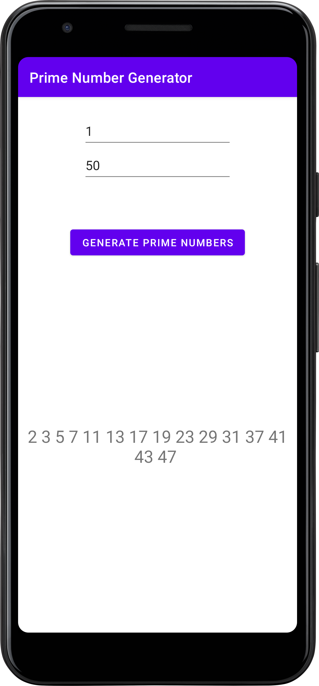

# Prime Numbers Android App

This Android application allows users to generate prime numbers within a specified range.
The user inputs two numbers, and the app returns the prime numbers within that range.

## Features

- **Generate Primes:** Input two numbers, and the app will display the prime numbers within that range.
- **Prank Detection:** If the two input numbers are the same, the app humorously detects it as a prank.

## Getting Started

1. **Clone the Repository:**
   ```bash
   git clone https://github.com/Hardvan/Prime-Numbers-App.git
   ```

2. **Open with Android Studio:**
    - Launch Android Studio.
    - Choose "Open an existing Android Studio project" and select the cloned directory.

3. **Run the App:**
    - Connect your Android device or use an emulator.
    - Click on the "Run" button in Android Studio.

## Usage

1. **Launch the App:**
    - Open the app on your Android device.

2. **Input Numbers:**
    - Enter two numbers in the provided EditText fields.

3. **Generate Primes:**
    - Click the "Generate" button.

4. **View Results:**
    - The prime numbers within the specified range will be displayed in the TextView.

## Screenshots


